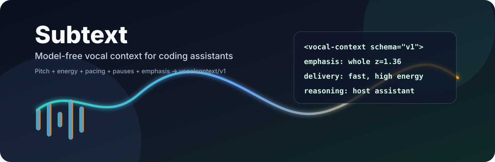
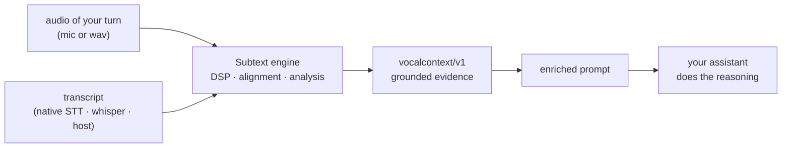

<p align="center">
  
</p>

<h1 align="center">Yell-at-AI / Subtext</h1>

<p align="center">
  <strong>Help your AI understand what you <em>mean</em> and the emotion of your natural speech.</strong><br>
  Not just the plain text transcript.
</p>

<p align="center">
  <sub><strong>Subtext</strong> is the product; it ships as the <code>yell-at-ai</code> npm package, and the CLI answers to both <code>subtext</code> and <code>yell-at-ai</code>.</sub>
</p>

<p align="center">
  <a href="#try-it-in-30-seconds"></a>
  <a href="#install"></a>
  <a href="docs/CONTRACT.md"></a>
  <a href="https://github.com/manishgit61332/Yell-at-AI/actions/workflows/ci.yml"></a>
  <a href="LICENSE"></a>
</p>

<p align="center">
  <a href="docs/QUICKSTART.md">Quickstart</a>
  ·
  <a href="docs/ARCHITECTURE.md">Architecture</a>
  ·
  <a href="docs/CONTRACT.md">Contract</a>
  ·
  <a href="docs/CALIBRATION.md">Calibration</a>
  ·
  <a href="docs/HARNESSES.md">Harnesses</a>
  ·
  <a href="docs/NATIVE_DESKTOP.md">Native Desktop</a>
  ·
  <a href="docs/TESTING.md">Testing</a>
</p>

---

## What It Is

Coding assistants hear your words but miss your meaning. Natural speech gets flattened into plain text,
and the word you leaned on, the question in your tone, the urgency, the hesitation — all of it vanishes
before the model ever responds. Your assistant answers the words, not what you meant.

**Subtext restores that missing layer.** It runs lightweight signal processing on the audio of your
turn, on your machine, and emits a strict `vocalcontext/v1` evidence block beside the transcript. The
assistant you already use does the reasoning; Subtext just hands it the evidence it was missing.

<p align="center">
  
</p>

```text
"ship the WHOLE thing"   →   transcript: "ship the whole thing"
                             + vocal-context: emphasis on "whole" (z=1.23),
                               emphatic delivery → treat "whole" as a constraint
```

> The promise is simple: your AI should understand what you mean and the emotion of your natural
> speech, not just the plain text transcript. Prosody is the evidence layer that makes that promise
> inspectable.

The transcript still comes from the platform's native voice model, OS dictation, browser dictation,
whisper, or your chosen host. Subtext never replaces speech recognition — it adds the missing
natural-speech context beside the transcript so the assistant can reason over what was meant, not only
what was written down. Nothing is sent over the network: it is model-free, offline, and zero-dependency.

## What It Reads

| Signal | What M0 Extracts | Why It Helps |
| --- | --- | --- |
| Pitch / F0 | autocorrelation pitch, range, median, slope, terminal movement | emphasis, uncertainty, emotional contour |
| Energy | frame-level RMS, peaks, and mel log-energy | stress, urgency, contrast |
| Pacing | speech duration and words per second | urgency or deliberation |
| Pauses | adaptive speech/pause density | hesitation, planning, interruption |
| Emphasis | word stress from five word-level prosody dimensions | what the user likely meant to highlight |
| Affect | grounded emotional coloring and meaning cues | how the assistant should interpret and respond |
| Assistant guidance | priority, response style, and behavior directives | consistent response behavior across harnesses |
| Voice quality proxy | jitter/shimmer-style frame variation | possible strain, carefully hedged |

## What It Can Say

| Evidence Flag | What It Means |
| --- | --- |
| `yelling` | very high energy plus elevated delivery |
| `emphasis` | a word or phrase was strongly stressed |
| `confusion` | confusion/question markers with hesitant or rising delivery |
| `hesitation` | filled pauses or high pause density |
| `uncertainty` | rising terminal pitch on non-question text |
| `urgency` | fast, high-energy delivery with few pauses |

## How it works

One engine, reused by every surface: it reads the audio of your turn, aligns it to the words, and
emits a grounded `vocalcontext/v1` block beside the transcript — the assistant you already use does the
reasoning.



## Try it in 30 seconds

**In the browser** — no install. Open **[yell-at-ai.vercel.app](https://yell-at-ai.vercel.app)**, allow
the mic, and speak a line with one word leaned on. You see the live transcript plus the vocal-context
Subtext reads from your delivery, all client-side — your audio never leaves the page.

> **Web demo:** [https://yell-at-ai.vercel.app](https://yell-at-ai.vercel.app) — fully client-side.
> Prefer local? Run it from [`apps/web`](apps/web) — see [apps/web/README.md](apps/web/README.md).

**From the terminal** — run it on the bundled sample with no setup. Works from any directory:

```sh
npx yell-at-ai demo
```

You get the transcript with a grounded evidence block prepended:

```text
<vocal-context schema="vocalcontext/v1">
Emphasis: whole z=1.23
Delivery: slow rate, medium energy, wide pitch range, low pause density, falling terminal pitch, steady voice quality
Affect: emphatic (0.62): Emphatic delivery; preserve stressed words as intentional constraints or priorities.
Guidance: preserve_emphasis/focused: Preserve stressed words as likely constraints or priorities: whole.
Flags: emphasis (0.62): strong stress on "whole"
</vocal-context>

ship the whole thing
```

## Install

Zero runtime dependencies. Run it on demand with `npx`, or install the CLI globally — both `yell-at-ai`
and `subtext` resolve to the same tool:

```sh
# run once, no install
npx yell-at-ai doctor

# or install globally
npm install -g yell-at-ai
yell-at-ai analyze --audio turn.wav --text "..." --format prompt
```

It needs only Node.js >= 20: no native compile step, no bundled model weights, no GPU, no API key, and
no default network egress. New here? Start with the [Quickstart](docs/QUICKSTART.md) for web, CLI, and
the Claude Code / Codex / VS Code editor adapters.

> **Tip — calibrate once for the best reads.** Uncalibrated analysis uses fixed thresholds that assume
> a typical recording level, so a quiet mic or an unusually loud/soft speaker can be under- or
> over-read. For the most reliable results across your microphone and speaking style, run
> `yell-at-ai calibrate` once; Subtext then judges each turn relative to *your* baseline instead of
> absolute thresholds. See [docs/CALIBRATION.md](docs/CALIBRATION.md).

## Status

An honest cut of what is shipped versus what is a working foundation today.

| Surface | State | Notes |
| --- | --- | --- |
| Prosody engine (`vocalcontext/v1`) | 🟢 shipped | model-free DSP, alignment, affect, flags; offline; cross-platform green on Windows, macOS, Linux |
| CLI / dev tool (`npx yell-at-ai`) | 🟢 shipped | `demo`, `analyze`, `capture`, `session`, `ptt`, `handoff`, `calibrate`, `serve`, `mcp`, `doctor` |
| Web demo | 🟢 shipped | [yell-at-ai.vercel.app](https://yell-at-ai.vercel.app) — mic → live dictation → client-side `vocalcontext/v1` → enriched prompt; static app in `apps/web/` |
| Editor adapters (Claude Code, Codex, VS Code) | 🟡 templates — manual install | `install-adapter` generates the bundle + host config; you wire it into the host yourself; no marketplace packages yet |
| HTTP + MCP-style JSON-RPC servers | 🟢 shipped | localhost-bound; `analyze_file` / `analyze_audio` tools |
| Native Windows push-to-talk app | 🟡 working foundation | Tauri/Rust dev build with global hotkey + node sidecar; signed `.msi` distribution is a documented follow-up |
| Offline whisper STT adapter | 🟡 working foundation | pluggable `whisper` adapter with binary auto-detect + docs; multi-platform binary bundling and model auto-download are follow-ups |

The production target remains a smaller Rust/Tauri core. This repo is the executable reference and test
oracle: the engine that every surface reuses.

<details>
<summary><strong>More commands &amp; usage</strong> — capture, session, push-to-talk, calibration, handoff</summary>

Analyze a turn with full detail, or open the local microphone preview at `http://127.0.0.1:8765`:

```sh
node bin/subtext.js analyze \
  --audio eval/fixtures/emphasis.wav \
  --text "can we just refactor the whole auth module" \
  --format prompt \
  --verbosity full

node bin/subtext.js serve
```

When your host voice layer exposes word timestamps, pass them as JSON to replace proportional fallback alignment:

```sh
node bin/subtext.js analyze --audio turn.wav --text "..." --word-timings word-timings.json
node bin/subtext.js analyze --audio turn.wav --transcript native-transcript.json --require-word-timings
```

Desktop capture:

```sh
node bin/subtext.js capture --duration 4 --audio-out turn.wav
node bin/subtext.js capture --duration 4 --audio-out turn.wav --text "..." --format prompt
```

Natural-speech session with host/native transcript integration:

```sh
node bin/subtext.js session \
  --duration 4 \
  --audio-out turn.wav \
  --transcript-command "host-transcript --json {audio}" \
  --target paste
```

Local push-to-talk loop:

```sh
node bin/subtext.js ptt \
  --turns 3 \
  --duration 4 \
  --transcript-command "host-transcript --json {audio}" \
  --target paste
```

Personal calibration:

```sh
node bin/subtext.js calibrate --audio neutral.wav --text "this is my normal voice" --out baseline.json
node bin/subtext.js calibrate --baseline baseline.json --audio neutral-2.wav --text "my normal follow-up voice" --out baseline.json
node bin/subtext.js analyze --audio turn.wav --text "..." --baseline baseline.json
node bin/subtext.js calibrate --profile laptop-mic --device built-in --environment desk --audio neutral.wav --text "normal voice"
node bin/subtext.js analyze --profile laptop-mic --audio turn.wav --text "..."
```

Universal paste-anywhere handoff:

```sh
node bin/subtext.js handoff --audio turn.wav --text "..." --target clipboard
node bin/subtext.js handoff --audio turn.wav --text "..." --target paste
```

</details>

<details>
<summary><strong>Full command &amp; script reference</strong></summary>

```sh
npm run build           # dry-run package validation
npm run fixtures        # regenerate synthetic WAV fixtures
npm test                # unit + golden + functional tests
npm run test:functional # CLI, HTTP, MCP, Claude hook, Codex config tests
npm run bench           # latency benchmark, p95 budget 300 ms
npm run smoke           # CLI + MCP smoke test
npm run desktop:check   # validate the native desktop scaffold
npm run harness:conformance # verify natural-speech cue behavior across harness policies
npm run readiness       # full check + harness/package/cue-guidance readiness report
npm run eval:judge      # generate paired LLM-judge prompts
npm run external:emotion # opt-in web audio emotion-evidence benchmark
npm run wild:youtube     # opt-in natural YouTube speech benchmark
node bin/subtext.js doctor # local harness readiness report
npm run package:adapters # generate local adapter bundles under dist/adapters
node bin/subtext.js install-adapter --harness codex --target ./subtext-codex-adapter
node bin/subtext.js install-adapter --harness hotkey --target ./subtext-hotkey-adapter
node bin/subtext.js install-adapter --harness native-desktop --target ./subtext-desktop-scaffold
node bin/subtext.js profile list # list named calibration profiles
npm run check           # build, tests, benchmark, smoke, and judge prompt pack
npm run eval:judge:mock # offline executable host-model judge report
```

Latest local verification:

```text
72/72 tests passing
20/20 functional plugin-boundary tests passing
p95 latency: 32.161 ms, budget: 300 ms
package dry-run: 125 files
external emotion evidence: opt-in, 21/25 on acted web clips
wild YouTube speech: opt-in, checked-in baseline 11/11; expanded 14-case manifest
desktop scaffold: Tauri/Rust scaffold check passing
harness conformance: yelling/emphasis/confusion cues + 12 harness policies passing
adapter doctor: 12/12 ready
adapter bundles: 12/12 generated
readiness: full check + yelling/emphasis/confusion guidance probes passing
```

The complete matrix is documented in [docs/TESTING.md](docs/TESTING.md).

</details>

## Integration Modes

| Tier | Platform Exposes | Subtext Does |
| --- | --- | --- |
| A · steer | native audio-in LLM | provide steering instructions and the contract shape |
| B · enrich | STT-to-text only | analyze audio in parallel and prepend `vocalcontext/v1` |
| C · own | any text field | own capture + preview + clipboard/active-app paste + local hotkey template + native desktop scaffold now; signed native global hotkey remains future work |

The same contract is used across all tiers.

## Project Map

```text
src/                 model-free DSP, capture, alignment, contract builder, rendering, servers
schemas/             strict vocalcontext/v1 and subtext/transcript/v1 JSON schemas
bin/subtext.js       CLI entrypoint
adapters/            Codex, Claude Code, VS Code, Realtime, hotkey, Universal adapter templates
apps/web/            deployable client-side web demo
apps/desktop/        Tauri/Rust scaffold for the native desktop launch track
ui/web-preview/      local browser microphone capture and preview harness
eval/fixtures/       generated WAV fixtures
eval/llm-judge/      transcript-only vs vocal-context prompt-pack harness
bench/               latency benchmark
test/                unit, golden, and functional tests
docs/                blueprint, architecture, contract, testing, licensing, roadmap
```

<details>
<summary><strong>Documentation</strong> — the full guide index</summary>

- [Quickstart](docs/QUICKSTART.md) — fastest path in: web demo, CLI, editor adapters
- [Blueprint](docs/BLUEPRINT.md) · [Architecture](docs/ARCHITECTURE.md) · [Contract](docs/CONTRACT.md) · [Prosody Style Tokens](docs/PROSODY_STYLE_TOKENS.md)
- [Harnesses](docs/HARNESSES.md) · [Harness Doctor](docs/HARNESS_DOCTOR.md) · [Harness Conformance](docs/HARNESS_CONFORMANCE.md) · [Adapter Packaging](docs/ADAPTER_PACKAGING.md)
- [Calibration](docs/CALIBRATION.md) · [Natural Speech](docs/NATURAL_SPEECH.md) · [Native Transcript Bridge](docs/NATIVE_TRANSCRIPT_BRIDGE.md) · [Universal Handoff](docs/UNIVERSAL_HANDOFF.md)
- [Desktop Capture](docs/DESKTOP_CAPTURE.md) · [Native Desktop](docs/NATIVE_DESKTOP.md) · [Web Preview](docs/WEB_PREVIEW.md)
- [Testing](docs/TESTING.md) · [External Emotion Eval](docs/EXTERNAL_EMOTION_EVAL.md) · [Wild YouTube Eval](docs/WILD_YOUTUBE_EVAL.md)
- [Changelog](CHANGELOG.md) — release history in Keep a Changelog format
- `subtext install-adapter` copies a harness bundle into a target directory with concrete generated config for this checkout.

</details>

## Authors And Attribution

Subtext / Yell-at-AI is authored by **[Suraj Kuncham](https://github.com/Suraj1235)** and **[Manish Sampathirao](https://github.com/manishgit61332)**.

The project is original M0 reference code, but it stands on speech/prosody research and open tooling:

| Area | Acknowledgements |
| --- | --- |
| Speech and prosody | eGeMAPS, openSMILE, Praat, Parselmouth, WebRTC VAD, whisper.cpp |
| Evaluation corpora and wild speech | CREMA-D, RAVDESS, Berlin EmoDB, MIT OCW, NASA, White House, City of Arvada, USGS, PyCon US, FOSDEM, GitButler, Stanford Online, TED, Google for Developers |
| Assistant ecosystem | Model Context Protocol, Claude Code, Codex, VS Code, realtime audio assistants |
| Runtime and future bindings | Node.js, JSON Schema, Tauri, cpal, napi-rs, PyO3 |

GitHub citation metadata lives in [CITATION.cff](CITATION.cff). Detailed attribution and dependency boundaries live here and in [NOTICE](NOTICE).

## License

This project is source-available for noncommercial individual, student, academic, and research use. Enterprise, commercial, revenue-generating, internal business, or paid-product use requires a commercial license.

See [LICENSE](LICENSE), [COMMERCIAL-LICENSE.md](COMMERCIAL-LICENSE.md), and [docs/LICENSING.md](docs/LICENSING.md).

This is intentionally not OSI open source while the commercial licensing model is in force.
