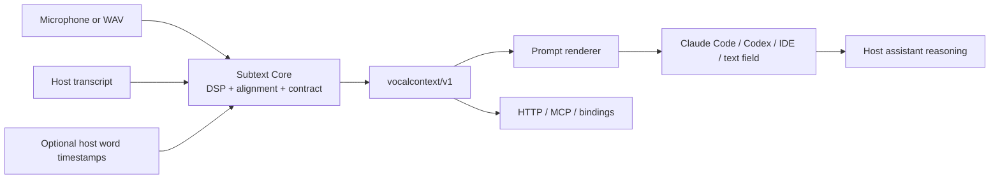
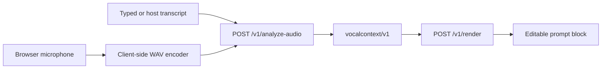
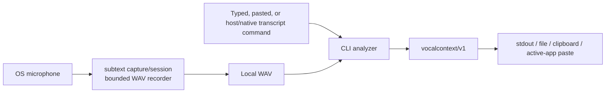

# Architecture

## Core Pipeline

1. Parse mono or multichannel WAV into normalized samples.
2. Frame audio into 30 ms windows with 10 ms hops.
3. Extract RMS energy, zero-crossing rate, and autocorrelation pitch.
4. Estimate speech/pause regions with an adaptive energy floor, short-gap bridging, and recording-frame silence trimming.
5. Align transcript tokens with host word timestamps when available, otherwise use proportional fallback across the detected speech span.
6. Compute the five word-level prosody dimensions: duration frames, Log-F0 range, Log-F0 median, Log-F0 slope, and Log-energy. Duration uses platform phone timestamps when a native voice layer provides them, otherwise estimated phone duration.
7. Score word emphasis and affect/intent cues from those features plus utterance-level prosody.
8. Categorize utterance-level prosody.
9. Emit `vocalcontext/v1`.
10. Render to a human-editable prompt block when needed.

## Prosody Style-Token Layer

Subtext is closest to a deterministic prosody style-token layer. It helps AI understand what the user means and the emotion in their natural speech by encoding pitch, energy, timing, pauses, emphasis, stress, and affect cues into explicit `vocalcontext/v1` fields, then letting the platform-native assistant model reason over that context.

That means:

- no custom speech foundation model
- no trained encoder-decoder replacement
- no bundled model weights
- no alternate model API hidden inside the plugin

The "encoder" is lightweight DSP plus alignment. The "decoder" is the prompt/MCP/IDE renderer. The host platform remains responsible for speech recognition, voice interaction, and assistant reasoning.

## Browser Preview Path

This is the first implemented Tier C harness. It proves local microphone capture and the audio-upload API without adding STT or network dependencies.

## Desktop Capture Path

`subtext capture` is the current desktop capture bridge. `subtext session` is the product-shaped turn flow: record for an explicit duration, receive transcript text from a host/native transcript command, derive emotion and meaning cues from the audio, and then render or hand off the enriched prompt block. `subtext ptt` repeats that flow for bounded turns, and the Hammerspoon adapter can bind one turn to a local global hotkey. This is still not a signed native background listener.

## Natural Speech Handling

Pause density is measured inside the detected speech window, not across the whole file. The engine bridges very short low-energy gaps so unvoiced consonants and recorder framing silence do not become fake hesitation. Pitch summaries are also computed from a filtered F0 track to reduce octave-tracking spikes before tension or pitch-range evidence is assigned.

## Adapter Rule

Adapters must not invent semantics. They can capture audio, pass `subtext/transcript/v1` transcript envelopes, render contracts, and inject text. The contract builder owns evidence generation.

## Production Path

The Node.js implementation is the reference and test oracle. The production core should move to Rust with:

- `cpal` or platform capture APIs
- optional openSMILE/eGeMAPS extraction
- the same schema tests
- the same fixture outputs within agreed tolerances
- Node/Python bindings generated from the Rust core

## Privacy Boundary

The engine has no network dependency. Audio is treated as local input and should remain memory-only unless the user opts into debug fixture capture. Adapters may send rendered text to the host assistant because that is the text the user explicitly submits.

See [PROSODY_STYLE_TOKENS.md](PROSODY_STYLE_TOKENS.md) for the longer framing.
