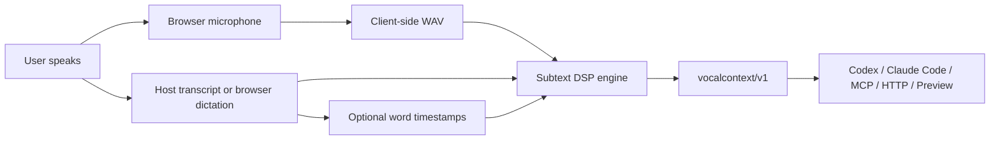

# Natural Speech Path

Subtext needs both halves of a spoken turn:

- audio, for prosody evidence
- transcript, for words and word-level emphasis
- optional host word timestamps, for exact word-level alignment

The point is to help the host AI understand what the user means and the emotion of their natural speech, instead of seeing only plain text. Subtext preserves cues such as urgency, emphasis, confusion, hesitation, tension, subdued delivery, and high-intensity moments.

The M0 natural-speech path is:



For local desktop capture outside the browser, use:

```sh
node bin/subtext.js capture --duration 4 --audio-out turn.wav
node bin/subtext.js capture --duration 4 --audio-out turn.wav --text "..." --format prompt
node bin/subtext.js session --duration 4 --transcript-command "host-transcript {audio}" --target paste
node bin/subtext.js ptt --turns 3 --duration 4 --transcript-command "host-transcript --json {audio}" --target paste
```

`capture` records a bounded WAV locally, then uses the same analyzer and handoff contract. `session` is the product-shaped path: it records one turn, calls a host/native transcript command for text, analyzes the audio for meaning and emotion, and emits or pastes the enriched prompt. `ptt` repeats that same path for a bounded number of local push-to-talk turns.

## What Is Local

Subtext's prosody engine is local:

- pitch/F0
- energy
- pacing
- pauses
- emphasis
- yelling/confusion/hesitation evidence
- baseline calibration

The speech window ignores leading/trailing recording silence and bridges very short low-energy gaps. That keeps normal clipped recordings from being treated as hesitant just because a recorder captured silence before or after the utterance.

Personal calibration can now roll forward across sessions. Each neutral calibration turn updates the existing `subtext/baseline/v1` profile with sample-weighted statistics, so naturally loud, fast, pausy, or expressive speakers are less likely to be misread as yelling, urgent, hesitant, or tense over time. Named profiles let the user keep separate baselines for different microphones or rooms.

## What Provides The Transcript

Subtext's job is meaning and emotion from natural speech; the transcript can come from:

- the assistant or IDE voice layer
- OS dictation
- the browser's SpeechRecognition API in the preview, when supported
- a local host/native bridge invoked through `--transcript-command`
- manual typing or paste

When structured metadata is available, use the [native transcript bridge](NATIVE_TRANSCRIPT_BRIDGE.md) envelope so every harness passes the same `text`, `source`, `confidence`, `language`, and `wordTimings` shape.

Browser dictation and transcript commands are bridge points for host speech recognition. Depending on browser/vendor or host command, they may use platform services. They are not part of the local Subtext DSP engine.

CLI transcript commands can write plain text to stdout:

```sh
node bin/subtext.js session \
  --duration 4 \
  --audio-out turn.wav \
  --transcript-command "host-transcript {audio}" \
  --target stdout
```

`{audio}` and `{audioPath}` are replaced with the recorded WAV path.

For better emphasis and timing, the command can instead write a JSON transcript object:

```json
{
  "schema": "subtext/transcript/v1",
  "text": "can we just refactor the whole auth module",
  "source": "host-native-voice",
  "confidence": 0.97,
  "language": "en",
  "wordTimings": [
    { "word": "can", "start": 0.0, "end": 0.22 },
    { "word": "we", "start": 0.25, "end": 0.45 },
    { "word": "whole", "start": 1.49, "end": 1.99 }
  ]
}
```

`--transcript-source`, `--transcript-confidence`, `--language`, and `--word-timings` still override command-provided metadata when explicitly supplied.

## Word Timestamps

If the host voice layer provides word timings, send them with the transcript:

```json
{
  "schema": "subtext/transcript/v1",
  "text": "can we just refactor the whole auth module",
  "source": "platform-native-voice",
  "confidence": 0.97,
  "language": "en",
  "wordTimings": [
    { "word": "can", "start": 0.0, "end": 0.22 },
    { "word": "we", "start": 0.25, "end": 0.45 },
    { "word": "whole", "start": 1.49, "end": 1.99 }
  ]
}
```

Subtext accepts this transcript object through the HTTP API, MCP tool, `--transcript <file>`, and `--transcript-command`. The engine matches timings to the transcript in order and emits `transcript.word_timestamps=true` plus `alignment.source="platform_word_timestamps"` when the match succeeds. If no timings are provided, it uses proportional fallback alignment across the detected speech window and reports `alignment.source="proportional"`.

## Rolling Baselines

Use repeated neutral turns to make the prosody layer more personal:

```sh
node bin/subtext.js calibrate --audio neutral-1.wav --text "this is my normal voice" --out baseline.json
node bin/subtext.js calibrate --baseline baseline.json --audio neutral-2.wav --text "can we inspect the auth flow" --out baseline.json
```

The browser preview performs the same rolling update when a baseline already exists in `localStorage`.

Use named profiles when the microphone or acoustic environment changes:

```sh
node bin/subtext.js calibrate --profile headset --device usb-headset --environment office --audio neutral.wav --text "normal voice"
node bin/subtext.js analyze --profile headset --audio turn.wav --text "..."
```

In the browser preview, selecting or capturing from a different microphone automatically switches to a microphone-specific profile when device enumeration is available.

## Why This Boundary Matters

The product promise is not "we ship a speech model." The promise is "we preserve what transcription throws away: meaning, emotional color, and intent." Subtext enriches whatever transcript your chosen harness already produces.

In other words, the platform's native voice model can stay in charge of speech recognition and interaction. Subtext adds a small prosody style-token side channel for tone, emphasis, pacing, pauses, and stress.
