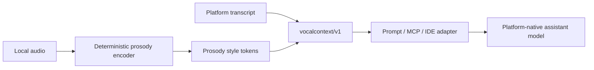

# Prosody Style Tokens

Subtext helps AI understand what you mean and the emotion of your natural speech. It can be understood as a deterministic prosody style-token layer beside the platform's native voice and assistant models.

It is not a custom speech foundation model or trained encoder-decoder stack. The platform still owns speech recognition, voice interaction, and assistant reasoning. Subtext listens to the same turn locally and emits compact, explicit vocal-context tokens so the host model can understand the user's meaning and emotional coloring beyond plain text.

## Architecture Analogy

The analogy to prosody style-token architectures is useful, but the implementation is deliberately simpler:

- The encoder is lightweight DSP, not a learned neural encoder.
- The tokens are human-readable evidence fields, not latent vectors.
- The decoder is a renderer or adapter, not a generated audio decoder.
- The host assistant remains the reasoning model.

## Token Families

The public `vocalcontext/v1` contract is the stable token surface:

| Token Family | Examples | Purpose |
| --- | --- | --- |
| Delivery | `rate=fast`, `energy=high`, `pause_density=low` | Helps the assistant distinguish urgency, calm, hesitation, or deliberation. |
| Contour | `terminal_pitch=rising`, `pitch_range=wide` | Preserves question-like or emphatic delivery lost in transcript-only input. |
| Emphasis | `emphasis(word="whole", z=1.36)` | Tells the assistant which word carried stress. |
| Word features | `duration_frames`, `log_f0_range`, `log_f0_median`, `log_f0_slope`, `log_energy` | Provides the five inspectable prosody dimensions behind emphasis and affect cues; duration uses platform phone timestamps when available. |
| Affect | `emotional_coloring=urgent`, `meaning_cues=["confusion"]` | Gives the host assistant a grounded natural-speech meaning layer. |
| Assistant guidance | `priority=clarify`, `directive=ask_clarifying_question` | Gives every harness the same response behavior for the same vocal evidence. |
| Voice quality | `voice_quality=tense` | Surfaces possible strain as low-confidence evidence. |
| Behavioral flags | `yelling`, `confusion`, `hesitation`, `urgency` | Provides compact cues with evidence and confidence. |
| Calibration | `baseline=personal`, `samples=3` | Keeps naturally loud or fast speakers from being misread. |

## Why This Matters

This keeps the plugin portable across Codex, Claude Code, VS Code, realtime assistants, and plain text fields:

- no custom training
- no bundled model weights
- no second inference bill
- no dependency on a separate foundational model
- one explainable side channel across harnesses

The tradeoff is honesty: Subtext is designed to help AI respond to emotion and intent in natural speech, but it keeps the emotional interpretation grounded in inspectable prosody cues such as high energy, strong stress, rising terminal pitch, hesitation, or timing evidence.
