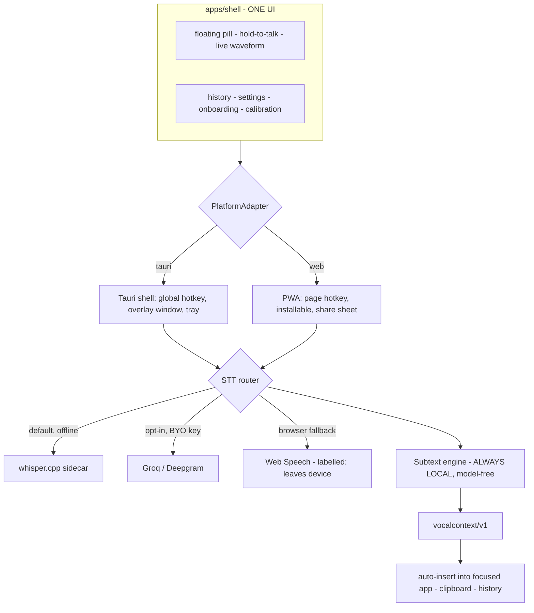

# Design: Yell-at-AI → Product Hunt Launch

Date: 2026-09-21
Status: approved design, pending implementation
Supersedes the scope of `plans/2026-06-30-launch-ready-design.md` — that plan delivered the reference
engine; this one delivers the product.

---

## 1. The Product (fixed — every decision below serves this)

Dictation is the vehicle. The product is the meaning that dies between your mouth and the model:
which word you leaned on, that you are on your third attempt and irritated, the "...right?" you put
at the end of a statement. Today users compensate by TYPING IN CAPS and repeating themselves.

**Yell-at-AI removes the need to compensate.** The name is literal: yell at your AI and it registers
that you are frustrated and responds differently.

The defensible part is *how*: **inspectable evidence, not vibes.** `emphasis on "whole", z=1.23` — an
auditable number — never "the user seems upset." No model, no weights, no key, no egress by default.
The assistant the user already pays for does the reasoning. That is why this is a **layer**, and why
it can live on every surface at once.

**Wispr Flow is the UX bar, not the product.** We need their smoothness wrapped around a layer they
do not have.

### Non-negotiables

| Invariant | Why |
| --- | --- |
| Prosody analysis is always local, always model-free | It is the moat and the privacy story |
| Every claim on the site and in the README is literally true | A false privacy claim is a launch-day liability |
| Offline is the shipped default; cloud is opt-in and labelled | The positioning collapses if the default phones home |
| One engine, every surface | Divergence between CLI and app is how this rots |
| Fail open, never block the user's prompt | Already the adapter rule; it now extends to the app |

---

## 2. Verified Starting Position (measured 2026-09-21, not assumed)

**Solid — do not rebuild:**

- Prosody engine, `vocalcontext/v1` contract, and renderer — **82/82 tests green**
- `npx yell-at-ai demo` works from any directory
- `src/transcribe/whisper.js` — whisper.cpp adapter, **written and unit-tested**, merely not CLI-wired
- Tauri shell: global hotkey, sidecar invocation, tray, status events — compiles and dev-runs
- `src/handoff/paste.js` — active-app insertion on Windows and macOS (plus Linux X11/Wayland)
- `apps/web` — mic capture, JS WAV encode, engine in-browser, polished 902-line stylesheet
- CI green on ubuntu/windows/macos × Node 20/22; CodeQL; release workflow; dependabot

**Gaps that block a product:**

| Gap | Evidence |
| --- | --- |
| No STT in any non-browser surface | `docs/WHISPER.md`: "library API only — not yet wired into the CLI" |
| Mic capture is macOS-only | `src/capture/recorder.js:75` throws on win32 and linux |
| **The privacy claim is false** | `apps/web` transcribes via the Web Speech API; Chrome streams that audio to Google, while the page says "your voice never leaves this tab" |
| Desktop app is a dev build | `bundle.active: false`, no icons, unsigned, requires Node on PATH, plain HTML window |
| Web app is a demo, not a tool | Record → analyze → **copy button**. No continuous dictation, no history, no auto-insert |
| Nothing is actually public | Repo **private**, npm `yell-at-ai` **404**, **0 GitHub releases** |

---

## 3. The Two Architectural Moves

Everything fast about this plan comes from these two decisions.

### Move 1 — Capture in the WebView, not the OS

Tauri renders a WebView, so `getUserMedia` and the existing JS WAV encoder work **inside the desktop
app**.

**Consequence:** the desktop product needs no ffmpeg bundle, no `sox`/`arecord` detection, and no fix
to the macOS-only `recordWav`. An entire cross-platform-capture workstream disappears. `recordWav`
stays as-is, scoped to its real job — headless CLI capture — as a documented CLI-only limitation.

### Move 2 — One frontend, two shells

The desktop app and the web app are both webviews, so they are **the same codebase**:

```text
apps/shell/            <- THE product UI (vanilla ES modules, no framework, no CDN)
  core/                   state machine, waveform, pill, history, settings, onboarding
  platform/
    platform.web.js       browser: Web Speech / WASM whisper, clipboard, IndexedDB
    platform.tauri.js     desktop: invoke() -> whisper sidecar, global hotkey, paste.js
  index.html
apps/web/              <- thin build: shell + platform.web.js + landing page   (Vercel)
apps/desktop/          <- thin build: shell + platform.tauri.js                 (Tauri)
```

One `PlatformAdapter` interface: `capture()`, `transcribe()`, `analyze()`, `insert()`, `store()`.
Build the Wispr-Flow UI **once**; it ships to Windows, macOS, Android, iPhone, and every browser.
Desktop and web cannot drift, because there is nothing to drift.

### Resulting architecture



---

## 4. Hybrid STT — the exact contract

`src/transcribe/index.js` already defines a pluggable adapter interface. Extend it; do not replace it.

| Engine | Default? | Where | Network |
| --- | --- | --- | --- |
| `whisper` (whisper.cpp sidecar) | **yes, on desktop** | desktop | none, ever |
| `webspeech` | fallback, browser | web / PWA | **yes — Chrome sends audio to Google** |
| `whisper-wasm` | opt-in, browser | web / PWA | model download only, then none |
| `cloud` (Groq or Deepgram, BYO key) | opt-in everywhere | all | yes, to the chosen vendor |

**Honesty rules, enforced in the UI and in tests:**

1. Every engine carries a machine-readable `egress: "none" | "vendor"` field.
2. Any engine with `egress: "vendor"` renders a persistent, non-dismissible badge naming the vendor.
3. Prosody analysis is local on every path — no exception, no toggle.
4. Marketing copy may claim "offline" only for `egress: "none"` paths, and a test asserts the wording.

This turns today's false claim into the strongest thing on the landing page.

---

## 5. The Wispr-Flow UX, specified

**The loop:** hold the hotkey → a pill appears near the cursor with a live waveform → speak → release
→ the text is inserted into whatever app has focus, with the vocal-context block attached per that
app's rule.

**Default hotkey** is `Ctrl+Alt+Y` on Windows and `Ctrl+Alt+Y` on macOS, matching the accelerator the
Tauri shell already registers. Deliberately *not* `Cmd+Space` (Spotlight) or `Ctrl+Space` (IME
switcher on Windows, completion in most editors). Onboarding lets the user rebind, and the binder
rejects an accelerator the OS refuses to register rather than failing silently.

| Element | Behaviour |
| --- | --- |
| Floating pill | Always-on-top, click-through, frameless overlay, roughly 180×48px. States: idle (hidden) → listening (live waveform) → thinking (shimmer) → inserted (checkmark, 600ms) → error (reason, dismissible) |
| Hold-to-talk | Press-and-hold is primary; tap-to-toggle for long dictation; Esc cancels and inserts nothing |
| Live prosody | **The signature moment:** the waveform tints as emphasis is detected, and the pill shows the flag chip (`emphasis`, `urgency`, `hesitation`) *while you speak*. Wispr Flow structurally cannot do this. |
| Insertion | `paste.js` into the focused app. Per-app rules: the full `<vocal-context>` block for known AI apps (Claude, Cursor, VS Code, ChatGPT, terminals); plain text everywhere else (Slack, email) |
| History | Last 100 turns: text, contract, audio duration, target app, timestamp. Local only. Re-copy, re-insert, delete, delete-all |
| Onboarding | Four screens: permission → hotkey pick → **calibration** (say one neutral sentence, reusing the existing `calibrate` flow, which is what makes reads accurate) → live test |
| Settings | Hotkey, mic device, STT engine and key, verbosity, per-app rules, launch-at-login, model manager |
| Tray | Status, pause, open history, settings, quit |

**Design direction:** inherit `apps/web/style.css` — dark, grain, teal and violet accents, the
`Yell@AI` wordmark. The product must look like the site that sells it.

---

## 6. Phases

Each phase ends green and shippable. Figures are **agent execution time**, not human working days. The non-compressible items in this program are external paperwork (certificate issuance, store enrolment, credentials, repo admin), not engineering.

### Phase 0 — Truth and unblock · ~30 min

Fix the false privacy claim everywhere it appears. Merge the three stale dependabot PRs. Repo public
(**requires @manishgit61332**). `npm publish yell-at-ai@0.1.0`. Cut GitHub release v0.1.0. Repo
description and topics. *Outcome: the thing is actually public, and every sentence in it is true.*

### Phase 1 — Real STT · ~1–2 hours

Wire `transcribe()` into the CLI as `subtext dictate`. Add the `cloud` adapter (Groq and Deepgram, BYO
key). Add the `egress` field and the honesty test. Model manager: download `ggml-base.en` on consent,
verify the checksum, resumable. *Outcome: end-to-end voice → enriched prompt with no external setup.*

### Phase 2 — `apps/shell` and the Wispr-Flow desktop app · ~4–8 hours

Extract the shared shell. Frameless overlay pill with waveform and live prosody chips.
Press-and-hold global hotkey. WebView capture. whisper sidecar via Tauri `externalBin` (win-x64,
mac-arm64, mac-x64, linux-x64). Auto-insert with per-app rules. History (SQLite). Settings.
Onboarding and calibration. Tray, autostart, icons. `bundle.active: true`. *Outcome: the hero
product.*

### Phase 3 — Web and PWA · ~1–2 hours

The same shell with `platform.web.js`. Installable PWA, offline app shell, iOS/Android viewport and
safe-areas, share-sheet handoff, IndexedDB history, honest engine badge, landing page above it.
*Outcome: Android, iPhone, and every browser covered at launch.*

### Phase 4 — Unbreakable, plus launch assets · ~2–3 hours of build

Signed installers (Authenticode `.msi`, notarized `.dmg`) built in CI. Auto-update. Crash and error
surfaces that never lose a user's words. The **fearless gauntlet** (§7). Demo video, Product Hunt
copy, screenshots, docs site. *Outcome: launch.*

### Phase 5 — post-launch

Android IME keyboard, iOS keyboard extension, Rust core port (M1).

**Roughly one focused day of build for Phases 0–4.** What sets the launch date is not build time — it is Authenticode/Apple enrolment lead time, npm credentials, and @manishgit61332 flipping the repo public. Shipping the first release unsigned removes the signing gate entirely, which is a legitimate choice for a free and open-source launch.

---

## 7. "Unbreaking" — the definition, as executable gates

Not a vibe. Ship is blocked unless all of these hold:

| # | Gate |
| --- | --- |
| 1 | **Never lose words.** Any failure after capture still puts the transcript on the clipboard and in history. An insertion failure is never data loss. |
| 2 | **Never block.** An analysis error still inserts the plain transcript. Fail open, matching the existing adapter rule. |
| 3 | **Never hang.** Every subprocess, hotkey handler, and network call is timeout-bounded with a visible error. |
| 4 | **Never capture silently.** Mic active implies pill visible. No hidden listening, ever. |
| 5 | **Cold start on a clean VM.** Fresh Windows and fresh macOS, no Node and no toolchain: install → onboard → dictate into Notepad/TextEdit. Automated in CI. |
| 6 | **Permission denial is a path, not a crash.** Mic denied, accessibility denied, hotkey taken, disk full, model missing, offline — each has a tested, actionable message. |
| 7 | **p95 release-to-insert budgets**, per engine, asserted in the existing bench harness for a five-second turn: under **1.5s** on the cloud engine, under **3.0s** on local `whisper base.en` on a 4-core CPU. Prosody analysis itself must stay inside its existing 300ms budget (measured 32ms p95 today), so any regression is attributable to STT, not to us. |
| 8 | **Every user-facing privacy claim is asserted by a test.** |

---

## 8. Risks and the gates I cannot clear

| Risk | Mitigation |
| --- | --- |
| **Repo is private; Suraj1235 has push but not admin** | @manishgit61332 must flip visibility. **Blocks Phase 0.** |
| **Code-signing lead time** — Authenticode OV takes ~1–5 business days; Apple Developer is $99/yr | Start enrolment **now**, in parallel with Phase 1. Unsigned means SmartScreen and Gatekeeper warnings, which is the opposite of fearless. |
| whisper.cpp binaries for four platforms bloat the installer | Ship the binary (~2MB); download the model (~142MB) on consent at first run |
| macOS Accessibility permission friction | Onboarding screen 1 handles it explicitly, with a re-check button |
| Noncommercial source-available license versus app stores | A legal decision for launch; flagged now, decided before Phase 4 |
| Live prosody chips require streaming analysis | The engine is 32ms p95 — run it on a rolling one-second window, and fall back to post-hoc if jitter shows |
| A Product Hunt launch across four surfaces is a 4× support surface | Phase 4 gate 5 (clean-VM cold start) is the guard |

---

## 9. Explicitly out of scope for launch

Native Android and iOS apps (the PWA covers those devices at launch), the Rust core port, accounts,
sync, billing, multi-language, team features, openSMILE parity, and marketplace plugin listings.
